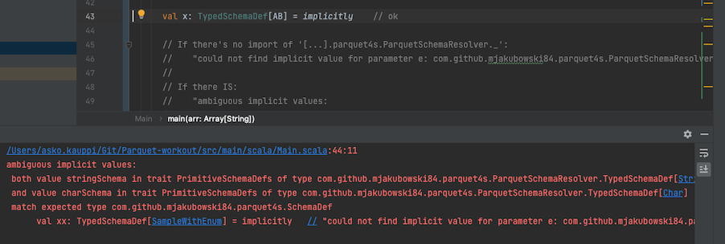

# Problem #1

Having a case class that contains an enumeration field:

```
case class SampleWithEnum(a: AB, b: Int)
```

Given that:

- there are implicit `OptionalValueEncoder[AB]` and `TypedSchemaDef[AB]` available

..I would expect that:

- the code compiles, and I can write out `SampleWithEnum` to Parquet.

## Reality

Compilation error:

```
could not find implicit value for parameter e: com.github.mjakubowski84.parquet4s.ParquetSchemaResolver.TypedSchemaDef[Main.SampleWithEnum]
```

>Or if taking a debugging line out - this is the real error:
>```
>Cannot write data of type Main.SampleWithEnum. Please check if there is implicit ValueEncoder available for each field and subfield of Main.SampleWithEnum.
>```

## Side walk

I'm used to [Circe](https://circe.github.io/circe/) encoding/decoding, and there it's sufficient to provide a field's transformers. Circe can then create the right ones for aggregate classes.

Is it supposed to be the same, with parquet4s?  I really don't know what to expect.


## Alternate reality

If I add this:

```
import com.github.mjakubowski84.parquet4s.ParquetSchemaResolver._
```

..the error changes to:



```
ambiguous implicit values:
 both value stringSchema in trait PrimitiveSchemaDefs of type com.github.mjakubowski84.parquet4s.ParquetSchemaResolver.TypedSchemaDef[String]
 and value charSchema in trait PrimitiveSchemaDefs of type com.github.mjakubowski84.parquet4s.ParquetSchemaResolver.TypedSchemaDef[Char]
 match expected type com.github.mjakubowski84.parquet4s.SchemaDef
      val xx: TypedSchemaDef[SampleWithEnum] = implicitly   // "could not find implicit value for parameter e: com.github.mjakubowski84.parquet4s.ParquetSchemaResolver.TypedSchemaDef[Main.SampleWithEnum]"
```
