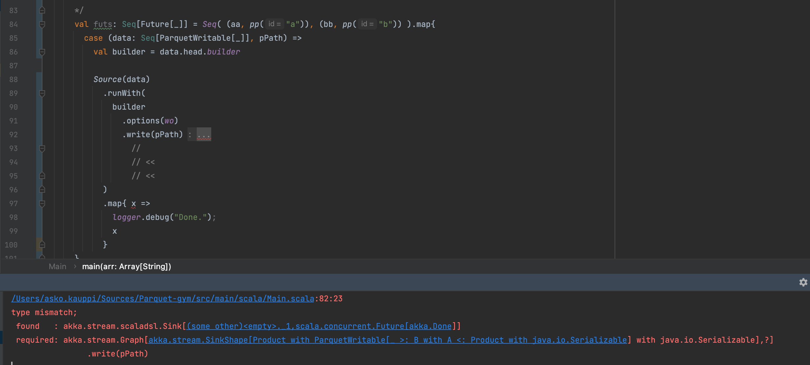

# Problem #2

Passing a case class via type parameter loses the ability of `parquet4s` to write it.

Having:

```
case class A(a: String, b: Int) extends ParquetWritable[A]
```

```
case class B(a: String, b: LocalDateTime) extends ParquetWritable[B]
```

..both of which can be written out by `parquet4s`, on their own.

Given that:

I am providing a function that accepts either, and checks that there are the implicit conditions required for writing:

```
def write[T : ParquetSchemaResolver : ParquetRecordEncoder](ts: Seq[T], pPath: ParquetPath)(implicit as: ActorSystem): Future[_] = {
  import as.dispatcher

  Source(ts)
    .runWith(
      ParquetStreams.toParquetSingleFile.of[T]
        .options(wo)
        .write(pPath)
    )
}
```

..I would expect that:

- the code compiles, and I can write out either `A` or `B` with this function.

## Reality

Compilation error:

```
Cannot write data of type Product with ParquetWritable[_ >: B with A <: Product with java.io.Serializable] with java.io.Serializable. Please check if there is implicit TypedSchemaDef available for each field and subfield of Product with ParquetWritable[_ >: B with A <: Product with java.io.Serializable] with java.io.Serializable.
          write(data, ppath)
```

..at calling the `write`.


## Analysis

Having `Product` in the error message indicates that the type information gets too loose, somewhere.. I am not versed enough in the innards of Scala (and parquet4s) to know what's really going on...

## Work-around effort "C"

Making each case class provide a `SingleFileParquetSink.Builder` as a method (just to see if there's *any* way...):

```
val builder: SingleFileParquetSink.Builder[T] = ParquetStreams.toParquetSingleFile.of[T]
```

..and making the Main code use it, without a `def[T]` (that might erase types):



Yet another compile error. Yet again, I don't understand the root cause...

## Work-around effort "D"


